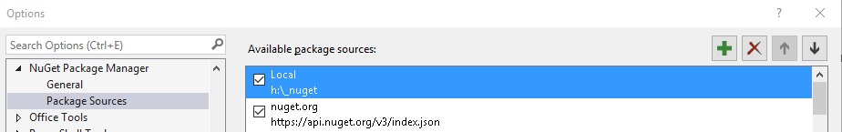
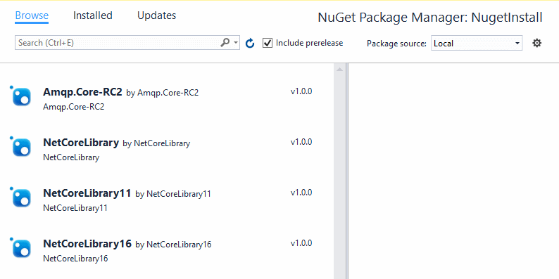

# NugetInstall 1.0
This utility helps automating the nuget package installation process in a local
shared folder that is set-up as repository for nuget.

Basically it provides the ability to run in different flavors the nuget.exe command
line in this form:
~~~~
nuget.exe add mypackage.nupkg -Source H:\_nuget
~~~~
This utility does *NOT* download nuget.exe. You should download the latest version from:    
[https://dist.nuget.org/win-x86-commandline/latest/nuget.exe](https://dist.nuget.org/win-x86-commandline/latest/nuget.exe)


This project was born to automate publishing .NET Core packages but it can
certainly be used in other contexts too.

When building a .NET Core the "postcompile" action can be instructed to:
* create the package in the current configuration (debug/release)
* saving the package in a folder (-o)
* running this utility from that folder to create the required nuget files and folders

In this readme, the H:\\_nuget is the local shared nuget repository (a simple folder on disk).
* It must contain the most recent nuget.exe utility
* It must contain this utility (exe and optionally the exe.config)

~~~~
Project.json root object:

  "scripts": {
    "postcompile": [
      "dotnet pack --no-build --configuration %compile:Configuration% -o H:\\_nuget",
      "H:\\_nuget\\NugetInstall -x -d -l "
    ]
  }
~~~~

### Command line options
~~~~
-h           Print the help
-ns          Does not install symbol packages
             It uses the SymbolsMarker identifier (".Symbols.") in the filename
             and exludes all the files containing this marker
		      
-s:path      The path where packages to install are located
             If omitted the current or the exe folder is used (see -x)
			  
-p:package   Install only the specified package (filename)
             If omitted, all the files found in the source folder
             are installed (subfolders are always ignored)
			  
-d           Delete the package files that are installed successfully
			  
-t:path      Specifies the path of the nuget repository
             If not specified the current or the exe folder is used (see -x)

-l           Creates a log in the path of the nuget repository (-t)
             The log filename is called "NugetInstall.log"

-x           Defaults paths to executable folder instead of current folder
             When folders are not specified explicitly, if this options is
             specified, the default folder is the one where the utility exe
             file is located.
             If this option is not specified, the CurrentDirectory is used.

-w           Wait a key to be pressed before exiting
             You should avoid this options when running a script from
             Visual Studio or other automated build systems.
~~~~

### Config file
The NugetInstall.Exe.Config may contain overrides for some settings:
````
  <appSettings>
    <add key="NugetExt" value="nupkg" />
    <add key="SymbolsMarker" value=".symbols." />
    <add key="NugetParams" value="add {0} -Source {1}"/>
  </appSettings>
````
If the .config is omitted, those values are enforced by code.
If the .config is present, the config values will override the hardcoded ones.
* NugetExt        this is the deault value for the nuget packages extension
* SymbolsMarker   the string identifying a symbol package
* NugetParams     the command line to be passed to nuget.exe

### Visual Studio 2015
To configure the local folder as a source for nuget packages, add it in the nuget config:


Then pick the local repo (or "All") when browsing the packages:



* * *
### Feedback
Any hint, suggestions, pull requests and help is welcome :)
* * *
###### Licensed with MIT License
###### Copyright (c) Raffaele Rialdi, 2016, @raffaeler aka Raf
